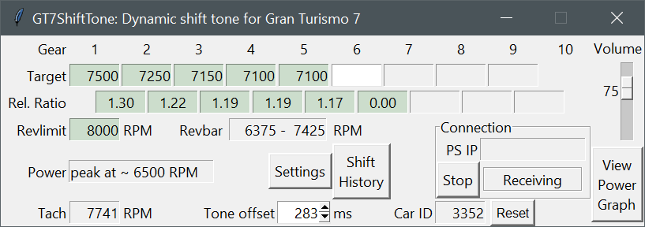
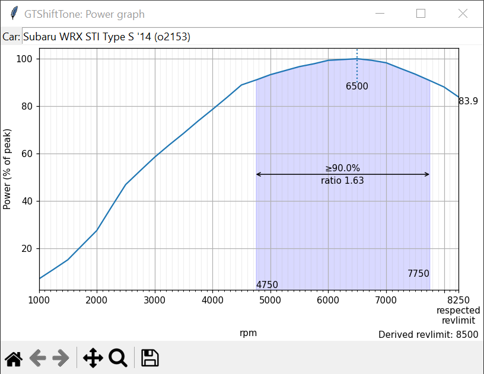

# GT7ShiftTone

**Calibrated audio tone that indicates when to shift for optimal acceleration in Gran Turismo 7**

# Optimal shift points
[Click here for optimal shift points with visualization of in-game UI on when to shift](/plots)

## Current release

GT7ShiftTone is being primarily developed for Group 1, 2, 3, 4 and B cars as they tend to run under BoP with fixed settings:
- This program should work out-of-the-box for supported cars, outside of saying 'Yes' once to the Windows Firewall 
- Be aware that false positives exist: not every beep is an upshift.

### Launch with:
- gtbeep.py: For Python users  
- GT7ShiftTone 0.51.exe: if you have downloaded the PyInstaller release

**Changes:**  
- Bundled the power curves of Group 1/2/3/4/B cars with the script code.
- Program attempts to find a running Playstation on the network automatically.
- Displayed shift points are rounded to the nearest 50. Internally, the program shifts to the precise value.

# Information below this point is not required for using the shift tone

Sample power curve:  

## Implementation

The Tone Offset is dynamic. The program keeps track of the time between a shift tone and an initiated shift, and modifies the running Tone Offset if the tone is early or late.

There are three triggers for the shift tone:
- **Shift RPM**: The RPM value at which power in the current gear becomes lower than the power in the next gear: the ideal time to upshift. If the application predicts shift RPM is reached in the defined tone offset time, trigger a beep
- **Percentage of revlimit**: Uses the tone offset distance as predicted distance to current RPM hitting the listed percentage of rev limit
  - Example: A rev limit of 7500 and a value of 98.0% triggers a tone if it predicts 7350 RPM will be reached in 283 milliseconds
- **Time distance to revlimit**: uses the tone offset value plus the revlimit ms value as predicted distance to current RPM hitting the defined revlimit. Defaults to 100 milliseconds, which leads to a default prediction distance of 383ms

The delay between beep triggers is currently set to 0.5 seconds. This time-out is shared between the three triggers.  
If you choose to not shift and remain above the trigger RPM, the program will not beep again even if revlimit is hit.

### General display values:

- **Revlimit**: The limit on engine RPM by its own power. Revlimit is derived upon finishing a full throttle sweep up to revlimit
- **Revbar**: The range in which the revbar lights up. It begins at 85% and starts blinking at 99% of a predetermined value
  - This is generally equal to the upshift line value in the Transmission tuning page, but there are exceptions.
- **Power**: At which RPM peak power is hit.
- **Tach**: The current RPM value as reported by the telemetry. Updates 30 times per second
- **Car ID**: The internal ID of the car. The RPM/Power/Torque table is saved with this ID as filename. For example, a car with Car ID 432 will have its data saved to _curves\432.tsv_

### Per gear:

- **Target**: The derived shift RPM value.  
- **Rel. Ratio**: The relative ratio of the gear ratios between two consecutive gears.  
If gear 2 has a gear ratio of 2.375 and gear 3 has a gear ratio of 1.761, then the relative ratio is 2.375/1.761 ≈ 1.35: third gear is 35% longer than second gear.
- **Ratio**: The gear ratio of the gear
  - Toggle between Ratio and Rel. Ratio by double clicking the "Ratio" or "Rel. Ratio" label text

### General configuration:

- **Tone offset**: Predicted distance between the beep trigger and the trigger RPM value.
  - This should not be taken as reaction time and minimized. It should be regarded as the time you consistently respond to the tone with the least amount of mental effort. Defaults to 283 ms.
- **Volume**: Adjusts the volume of the beep in four steps total. Each step is about half as loud as the previous, where the second loudest is the default. A value of 0 mutes only the shift beep.
- **Reset button**: If pressed, reset revlimit, power curve and all values for all gears. Configuration values are unchanged. If the UI is unresponsive, restart the application.
- **Start/Stop button**: Stops or starts the loop to collect packets. In short, if button says "Stop" it is running, if it says "Start" the program is not tracking the game's packets and will not beep.
- **Shift history**: Displays a table with the last 10 shifts including target RPM, actual shift RPM, gear and measured offset between beep and shift.
- **View Power Graph**: If enabled and pressed, displays a power graph in a separate window.

In **Settings**:  
- **Hysteresis**: Hysteresis may be set as another layer to smooth RPM. An intermediary RPM value is updated only if the change in RPM is larger than the hysteresis value, which is then used for the shift beep tests. Defaults to 0.5% of maximum engine RPM.
- **Revlimit %**: The respected rev limit in percentage of actual rev limit. This is to create a buffer for transients that could cause the engine to cut out due to hitting actual rev limit. Defaults to 98.0%.
- **Revlimit ms**: The minimum predicted distance to actual rev limit. This is to create a buffer for fast changes in RPM that would otherwise lead to hitting actual rev limit, such as in first gear. Defaults to 100ms.
- **Dynamic Tone Offset**: Enables or disables the dynamic updating of the tone offset.
- **Include replays**: Sets the program to function during replays: useful primarily to log shift points in a replay.

## Playstation IP-address

The program will attempt to find an active Playstation console with Gran Turismo 7 active. It does this by assuming both the Playstation and the device the code runs on are on the same local network (the most common range of 192.168.x.y).  
If that fails, you will need to find and manually set your console IP address into the UI:

- Find the IP address by going to the PS Settings -> Network -> Connection Status -> View Connection Status -> IPv4 address
- Press Stop to stop the background loop
- Enter this IPv4 address into the PS IP entry box then hit Start
  - After this, GT7ShiftTone will automatically connect to this address and autostart

## Settings are saved to config.json

The settings are saved to _config.json_ on exit. This includes Tone offset, Hysteresis, Revlimit %, Revlimit ms, Volume, Dynamic Tone Offset. The gear ratios are not saved, they are provided by the real time telemetry data.  
Remote telemetry sends data at 60 packets per second. The offset variables (Tone offset, revlimit ms) while defined in milliseconds currently use packet counts in the backend.  
There is one packet per 16.667 milliseconds, approximately.

## Notes and known issues
- Assumptions: Stock or BoP, full throttle, not grip limited, instantaneous perfect shifts
- Gear 9 and 10 are never filled in even if the car has them: Limitation of the telemetry and implementation.
- The program assumes the car is driven with the stock Power curve, some upgrades will result in suboptimal shifts:
  - Power Restrictor for example affects the shape of the curve: adjustments will not match a saved curve.
  - Turbos affect the shape considerably and increase the cost of shifting
  - Upgrades that affect the RPM range of the engine
- The default values are arbitrarily chosen and may not suit individual cars or track surface.
- (Script only) On Windows the socket is not closed cleanly for no apparent reason: requiring a new console on most consecutive launches
- Application will on rare occasions just crash: related to the UI library and cannot be fixed
- No Linux support: but only DPI scaling and sound rely on a Windows-only package
- This program _'works for me'_. If you wish to run this script and there are issues, please report them.
