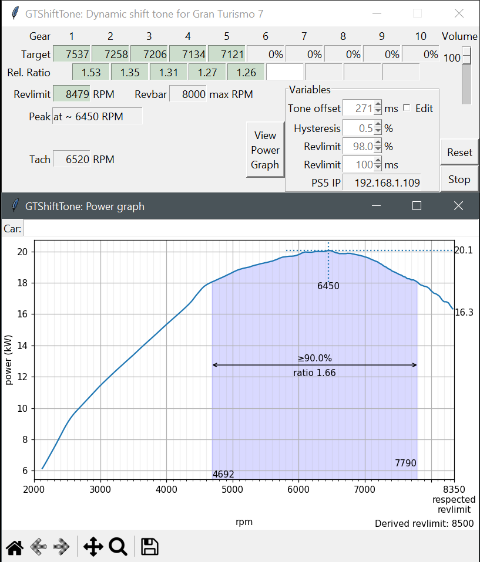

# GT7ShiftTone
It beeps, you shift.

**Windows GUI application to provide a shift tone for Gran Turismo 7.**

## Steps
- One time: Enter your Console IP into the UI then hit Start
- Load into Special Route X Time Trial, drive until past the first tunnel
- Straighten the car, apply full throttle in a gear that goes from low/medium RPM to revlimit in a few seconds
- The moment revlimit is hit, briefly press handbrake to initiate the clutch
- Let the car roll for several seconds to 10 seconds (finish before the uphill section)
  - Avoid steering inputs as much as possible, controller is preferable
- Press throttle to finish. You can now go to other races with a shift beep.
- Be aware that false positives exist: not every beep is an upshift.

## Current release
First public version. This program is not yet user friendly and does not save any car data yet.

### Launch with:
- gtbeep.py: For Python users  
- ~~**GT7ShiftTone.vbs**: to launch the application (Preferred, requires ZIP download)~~  
- ~~**GT7ShiftTone-debug.bat**: to launch the application with an additional commandline window that shows debug information (requires ZIP download)~~

Changes:  
- Initial release converted from ForzaShiftTone

## Implementation

The approach is to get consecutive points of acceleration values across a large range of RPMs up to revlimit. These acceleration values will include the acceleration from engine torque minus various resistive forces.  
We derive drag by letting the car coast with the clutch engaged and working out what the negative acceleration is based on speed. We add this back to the acceleration curve to cancel out the drag and this gives us the basic torque curve.  
We ignore other sources of losses such as rolling resistance as drag is dominant at higher speeds: The resulting curve is close enough.

The Tone Offset is dynamic. The program keeps track of the time between a shift tone and an initiated shift, and modifies the running Tone Offset if the tone is early or late.
There are three triggers:
- Shift RPM: The RPM value at which power in the current gear becomes lower than the power in the next gear: the ideal time to upshift. If the application predicts shift RPM is reached in the defined tone offset time, trigger a beep
- Percentage of revlimit: Uses the tone offset distance as predicted distance to current RPM hitting the listed percentage of rev limit
  - Example: A rev limit of 7500 and a value of 98.0% triggers a tone if it predicts 7350 RPM will be reached in 283 milliseconds
- Time distance to revlimit: uses the tone offset value plus the revlimit ms value as predicted distance to current RPM hitting the defined revlimit. Defaults to 100 milliseconds, which leads to a default prediction distance of 383ms

The delay between beep triggers is currently set to 0.5 seconds. This time-out is shared between the three triggers.  
If you choose to not shift and remain above the trigger RPM, the program will not beep again even if revlimit is hit.

## Settings

The settings are saved to _config.json_ on exit. This includes Tone offset, Hysteresis, Revlimit %, Revlimit ms and Volume. The power curve and gear ratios are not saved.  
Remote telemetry sends data at 60 packets per second. The offset variables (Tone offset, revlimit ms) while defined in milliseconds currently use packet counts in the backend.  
There is one packet per 16.667 milliseconds, approximately.

### General display values:

- Revlimit: The limit on engine RPM by its own power. Revlimit is derived upon finishing a full throttle sweep up to revlimit.
- Revbar: The RPM value where the in-game revbar is full and starts blinking. This is the same as the RPM value shown when looking at the transmission in the tuning page.
- Tach: The current RPM value as reported by the telemetry. Updates 30 times per second.

### Per gear:

- Target: The derived shift RPM value.  
This requires a power curve and the ratio of the current gear and the next gear to be determined (green background)
- Rel. Ratio: The relative ratio of the gear ratios between two consecutive gears.  
If gear 2 has a gear ratio of 2.375 and gear 3 has a gear ratio of 1.761 then the relative ratio is 2.375/1.761 = 1.35 approximately: third gear is 35% longer than second gear.

### General configuration:

- Tone offset: Predicted distance between the beep trigger and the trigger RPM value. This should not be taken as reaction time and minimized. It should be regarded as the time you can consistently respond to the tone with the least amount of mental effort. Defaults to 283 ms.
- Revlimit %: The respected rev limit in percentage of actual rev limit. This is to create a buffer for transients that could cause the engine to cut out due to hitting actual rev limit. Defaults to 98.0%.
- Revlimit ms: The minimum predicted distance to actual rev limit. This is to create a buffer for fast changes in RPM that would otherwise lead to hitting actual rev limit, such as in first gear. Defaults to 100ms.
- Hysteresis: Hysteresis may be set as another layer to smooth RPM. An intermediary RPM value is updated only if the change in RPM is larger than the hysteresis value, which is then used for the shift beep tests. Defaults to 0.5% of maximum engine RPM.
- Volume: Adjusts the volume of the beep in four steps total. Each step is about half as loud as the previous, where the second loudest is the default. A value of 0 mutes only the shift beep.
- Edit tickbox: If unticked, the up and down arrows for the Tone offset, Revlimit ms/% and Hysteresis values do not function. This is to avoid accidental clicks.
- Reset button: If pressed, reset revlimit, power curve and all values for all gears. Configuration values are unchanged. If the UI is unresponsive, restart the application.
- Start/Stop button: Stops or starts the loop to collect packets. In short, if button says "Stop" it is running, if it says "Start" the program is not tracking the game's packets and will not beep.
- View graphs button: If enabled and pressed, displays a power graph in a separate window. 

## Known issues
- Application will on rare occasions crash: related to the UI library and cannot be fixed
- Power values in the graph are percentage-based: GT7 only provides acceleration not power/torque.
- Due to noise in the acceleration data it is not always possible to derive at which RPM peak power occurs. It can be off by 50 or 100 RPM.
- The data is smoothed and will not 100% match the ingame curve which is linear interpolation between points
- Some cars have a harsh drop in power and will not hit revlimit at higher gears (Super Formula '23 for example), complicating data gathering
- The default values are arbitrarily chosen and may not suit individual cars or track surface: so far, shifts appear to be too early.
- Revlimit is an approximation and is equal to the last highest RPM seen on the full throttle run.
- On Windows the socket is not closed cleanly for no apparent reason: requiring a new console on every launch
- Linux support is untested
